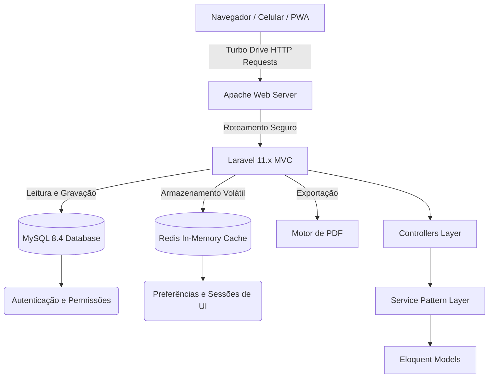

<div align="center">
  
  

  # FinControl — Gestão Financeira Pessoal e Corporativa

  <p align="center">
    <strong>Projeto Avançado de Engenharia de Software</strong><br>
    <em>Uma plataforma robusta que consolida fluxo de caixa, investimentos e cartões de crédito,<br> desenvolvida com foco absoluto na Experiência do Usuário (UX) e performance ponta a ponta.</em>
  </p>

  <p align="center">
    <a href="#-visão-geral-e-propósito">Visão Geral</a> •
    <a href="#-100-dos-requisitos-cumpridos">Requisitos</a> •
    <a href="#-arquitetura-e-padrões-de-projeto">Arquitetura</a> •
    <a href="#-experiência-do-usuário-ux-e-tecnologias">Tecnologias</a> •
    <a href="#-guia-de-instalação-para-iniciantes">Como Rodar</a> •
    <a href="#-como-acessar-pelo-celular">Acesso Mobile</a>
  </p>

  <p align="center">
    
    
    
    
    
  </p>
</div>

---

## 🎯 Visão Geral e Propósito

O **FinControl** foi idealizado para ser uma suíte corporativa completa e definitiva. Muito além de registrar "entradas e saídas", o sistema atua como um cérebro financeiro: consolida a previsibilidade de fluxo de caixa baseada em inteligência algorítmica, monitora limites de múltiplos cartões de crédito simultaneamente, automatiza faturas recorrentes e acompanha a rentabilidade matemática de ativos de investimentos (como CDBs e Tesouro Direto).

O projeto foi construído respeitando rigorosamente os padrões da **Engenharia de Software**, garantindo alta coesão, baixo acoplamento e isolamento de regras de negócios pesadas através da aplicação do *Service Pattern*.

---

## 🏆 100% dos Requisitos Cumpridos

A aplicação mapeia e atende com excelência técnica **todos os Requisitos Funcionais (RFs)** exigidos pelo projeto, garantindo total rastreabilidade da documentação até a linha de código:

- **RF01:** Autenticação segura por e-mail e senha utilizando hashes Bcrypt.
- **RF02 & RF14:** Criação completa (CRUD) de Lançamentos Financeiros, Categorias customizadas, Contas e Clientes.
- **RF03 & RF05:** Travas e Bloqueios Lógicos. Lançamentos sinalizados como "Pagos" têm sua edição bloqueada não apenas na interface visual, mas também protegidos na camada de *Controllers* e *Services* do servidor.
- **RF06, RF07 & RF08:** Módulo avançado de controle de faturas, permitindo parcelamentos e monitoramento consolidado de limite por cartões de crédito.
- **RF09:** Motor de faturamento automatizado. Despesas recorrentes são injetadas sem esforço humano na virada de cada mês (via *Cron/Schedule*).
- **RF10:** Sistema invisível de Auditoria de Dados. Absolutamente qualquer alteração no sistema (Quem alterou, O que era antes, O que ficou depois, e a Data Exata) é registrada em *logs* internos para rastreabilidade de falhas.
- **RF11 & RF17:** Motor de Projeção Algorítmica e filtros combinados por Conta e Período (com algoritmos que calculam a média histórica do usuário para "prever" despesas futuras).
- **RF12:** Controle reativo de Saldo Negativo. A interface e a *Dashboard* mudam de cor e emitem alertas severos caso alguma conta bancária caia abaixo de R$ 0,00.
- **RF13:** Anexo de Documentos Comprobatórios (Notas Fiscais).
- **RF15 & RF16:** Geração de estatísticas reais mostrando de onde vem a maior porcentagem de Receitas (dividido por clientes e por categorias).
- **RF18:** Módulo de relatórios mensais gerenciais **Exportáveis em PDF**. Geração imutável utilizando motor *DOMPdf* com tradução nativa e gráficos em barras.

---

## ✨ Experiência do Usuário (UX) e Tecnologias

Optamos por abandonar a necessidade de *frameworks* pesados no lado do cliente (como React ou Vue) que exigiriam a construção de APIs separadas. Em vez disso, aplicamos o que há de mais moderno na web:

1. **Hotwire Turbo 8 (Sensação de SPA):** A navegação no FinControl é **instantânea**. As páginas não recarregam (não há o famoso "piscar branco" de sites antigos). O Turbo intercepta os cliques e atualiza apenas os fragmentos do HTML pela rede.
2. **Design Fluido e View Transitions:** Uma transição natural e suave entre as abas e botões graças à View Transitions API nativa dos navegadores.
3. **Múltiplos Temas Dinâmicos (Dark/Light/Amoled):** A Central de Configurações permite que o usuário altere a interface com um clique. Destaca-se o modo **Amoled**, que desliga completamente os pixels pretos do monitor/celular, reduzindo cansaço visual e economizando bateria de dispositivos móveis.
4. **Internacionalização e Moedas:** Motor de tradução nativo integrado, permitindo que a aplicação seja consumida no formato Real Brasileiro (R$) ou internacional.

---

## 🛠 Arquitetura e Padrões de Projeto



*Nota para Engenharia:* Utilizamos fortemente o **Service Pattern** para extrair as lógicas de negócios mais difíceis (ex: *CashFlowProjectionService*) para fora dos *Controllers*. Isso mantém o código perfeitamente sustentável e os testes mais limpos.

---

## 🚀 Guia de Instalação para Iniciantes

Para não sofrer com o famoso problema de *"Na minha máquina não funciona"*, este projeto foi **100% empacotado dentro do Docker**. 
Isso significa que você não precisa instalar PHP, Composer, Apache, MySQL ou Servidores no seu computador para testar. **Tudo está dentro de caixas isoladas (containers) que o Docker gerencia sozinho.**

### Pré-requisitos (O único que você precisa)
- Ter o **[Docker Desktop](https://www.docker.com/products/docker-desktop/)** instalado no seu PC ou Mac.

### Passo 1: Como Iniciar a Estrutura (Funciona igual no Mac, Windows e Linux)
1. Baixe o código fonte para a sua máquina ou clone o repositório:
   ```bash
   git clone https://github.com/GatoSemOrelha/fincontrol-engenharia.git
   cd fincontrol-engenharia
   ```

2. Abra o terminal (CMD, PowerShell, Bash ou Terminal do Mac) dentro da pasta onde você baixou o projeto.

3. Execute o comando mágico que baixa os servidores, configura o banco e instala as dependências por você:
   ```bash
   docker compose up -d --build
   ```
   > ⏳ *Atenção: A primeira vez pode demorar alguns minutos, pois ele estará construindo a máquina virtual. Pode ir pegar um café!*

### Passo 2: Criando o Banco de Dados com Dados de Teste
O container já está rodando. Agora precisamos dizer para o projeto criar as tabelas financeiras e colocar usuários falsos para testarmos.
Ainda no terminal, rode o instalador interno:
```bash
docker compose exec app php artisan migrate:fresh --seed
```

### Passo 3: Acesse e Divirta-se!
Abra o seu navegador no seu computador e acesse os seguintes links:
- **Painel do FinControl:** [http://localhost:8000](http://localhost:8000)
- **Gerenciador de Banco de Dados Visual (phpMyAdmin):** [http://localhost:8080](http://localhost:8080) *(Usuário: `root`, Senha: `rootpass123`)*

**Credenciais Padrão do Sistema:**
> **E-mail:** `joao@empresa.com.br`  
> **Senha:** `admin123`

*(Para parar o sistema e desligar os servidores, basta abrir o terminal e rodar `docker compose down`)*.

---

## 📱 Como Acessar pelo Celular

Como a aplicação é um **Web App Responsivo**, ela se molda perfeitamente na tela de qualquer Smartphone (iOS ou Android). Não é necessário instalar nenhum arquivo `.apk`.

Para ver o sistema funcionando direto no seu celular:

1. Certifique-se de que o sistema está **rodando no seu computador** (com o Docker ligado).
2. O seu Celular e o seu Computador precisam estar **conectados na mesma rede Wi-Fi**.
3. Descubra o IP do seu computador:
   - **No Windows:** Abra o `CMD`, digite `ipconfig` e procure a linha "Endereço IPv4" (Ex: `192.168.x.x`).
   - **No Mac:** Vá em Preferências do Sistema > Rede, e veja o Endereço de IP listado (Ex: `192.168.x.x`).
   - **No Linux:** Digite `hostname -I` no terminal.
4. Abra o Google Chrome ou o Safari no seu celular e digite:
   👉 `http://SEU_IP_AQUI:8000` (exemplo: `http://192.168.0.147:8000`)

O app carregará em tempo real. Você pode inclusive ir nas configurações do Safari/Chrome no celular e clicar em *"Adicionar à Tela Inicial"* para que ele crie um atalho com logo do FinControl, imitando um Aplicativo Nativo!

---

<div align="center">
  <strong>Construído com obsessão por qualidade estética e técnica.</strong><br>
  Engenharia de Software — 2026
</div>
