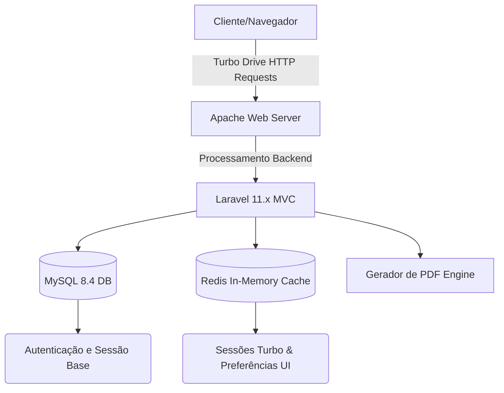

<div align="center">
  
  

  # FinControl — Gestão Financeira Premium

  <p align="center">
    <strong>Plataforma corporativa e pessoal para gestão de fluxo de caixa, investimentos e cartões de crédito.</strong><br>
    Construído com obsessão em Experiência do Usuário (UX) e performance ponta a ponta.
  </p>

  <p align="center">
    <a href="#-visão-geral">Visão Geral</a> •
    <a href="#-principais-funcionalidades">Funcionalidades</a> •
    <a href="#-arquitetura-e-tecnologias">Arquitetura</a> •
    <a href="#-como-rodar-o-projeto">Instalação</a> •
    <a href="#-licença">Licença</a>
  </p>

  <p align="center">
    
    
    
    
    
  </p>
</div>

---

## 🎯 Visão Geral

O **FinControl** não é apenas um sistema de "entradas e saídas". Ele foi idealizado para ser uma suíte corporativa completa, que consolida a previsibilidade do seu fluxo de caixa, monitora faturas ativas, gera inteligência através de relatórios mensais estáticos e acompanha a rentabilidade de seus ativos (Ações, CDBs e Tesouro Direto).

A interface foi projetada baseada em aplicações **Single Page (SPA)** sem a necessidade de frameworks JavaScript massivos (como React ou Vue), utilizando a tecnologia **Hotwire/Turbo 8** para trafegar fragmentos de DOM através da rede.

## ✨ Principais Funcionalidades

### 1. Engine de Performance e UI (Turbo 8)
- **Zero Page Reloads:** Navegação instantânea e fluida entre abas (View Transitions nativo).
- **Temas Dinâmicos Inteligentes:** Modo Claro, Escuro e **Amoled** (otimizado para telas OLED), alteráveis em tempo real sem "piscar" a tela.
- **Micro-interações:** Barras de rolagem refinadas, modais de confirmação elegantes e *hover effects* polidos usando CSS Vanilla moderno.

### 2. Gestão Financeira Nuclear
- **Dashboard Central:** Métricas rápidas e status da saúde financeira dos últimos 6 meses.
- **Relatórios Gerenciais Exportáveis:** PDF construído de forma programática utilizando DOMPdf com suporte nativo a internacionalização e múltiplos formatos de moeda (`money()`).
- **Despesas Recorrentes Inteligentes:** Motor que gera faturas fixas de forma autônoma a cada novo mês.

### 3. Módulos Avançados
- **Cartões de Crédito:** Controle limite, dias de corte, dias de vencimento e parcelamentos nativos por fatura.
- **Investimentos:** Segmentação entre Renda Fixa e Variável, taxa de rendimento (CDB) acumulada e relatórios de participação no patrimônio líquido.
- **Central de Configurações:** Customização global de moedas, idiomas (PT-BR e EN) e preferências do perfil (gravado via sessão do Laravel).

---

## 🛠 Arquitetura e Tecnologias

A aplicação consolida estabilidade de backend acoplado à performance de frontend de nova geração.



- **Backend:** Laravel 11.x (PHP 8.3)
- **Frontend Engine:** Hotwire Turbo 8 (Substituição de pacotes via rede sem recarregar scripts globais).
- **Styling:** CSS Vanilla de alta customização, arquitetado com *Custom Properties (Tokens)*, sem a poluição visual de frameworks engessados.
- **Persistência de Dados:** MySQL 8.4 (via Docker).
- **Cache & Sessão:** Redis ultra-rápido para manter as preferências visuais do usuário entre os requests assíncronos.

---

## 🚀 Como Rodar o Projeto

A infraestrutura foi pensada sob o conceito de **"Zero Configuração"**. Se você tiver o [Docker](https://www.docker.com/) rodando na máquina, a aplicação subirá perfeitamente com 3 comandos no terminal.

### 1. Clonar Repositório
```bash
git clone https://github.com/GatoSemOrelha/fincontrol-engenharia.git
cd fincontrol-engenharia
```

### 2. Levantar os Containers (Subir Arquitetura)
O `docker-compose.yml` está configurado para baixar o MySQL, Redis, Apache, PHP e compilar as dependências de todo o Composer para dentro da imagem de forma transparente.
```bash
docker compose up -d --build
```
> Aguarde a barra de progresso terminar. A imagem irá construir todas as dependências automaticamente.

### 3. Migrar Dados Iniciais (Database)
Execute o instalador interno dentro do container da aplicação para criar as tabelas e usuários administrativos de teste:
```bash
docker compose exec app php artisan migrate:fresh --seed
```

### 🎯 Acessos Prontos
| Serviço | URL Local | Credenciais Padrão (Seeded) |
|---|---|---|
| **FinControl App** | [http://localhost:8000](http://localhost:8000) | `joao@empresa.com.br` / `admin123` |
| **phpMyAdmin** (DB) | [http://localhost:8080](http://localhost:8080) | `root` / `rootpass123` |

---

## 📸 Prévia do Sistema (Screenshots)

*Sinta-se à vontade para hospedar as screenshots da aplicação real aqui futuramente.*

<p align="center">
  
  
</p>

---

## 🔒 Segurança

- **Proteção CSRF Completa** blindando os formulários submetidos nativamente.
- Tratamentos de XSS utilizando as engines restritivas da Blade Templating Engine.
- Restrição de arquivos temporários e ignorados via `.gitignore`.
- Senhas protegidas através de Hashes Bcrypt avançados na versão mais recente do framework.

---

<div align="center">
  <strong>Desenvolvido como projeto de Engenharia de Software</strong><br>
  Construído com Laravel 11 & Docker | 2026
</div>
