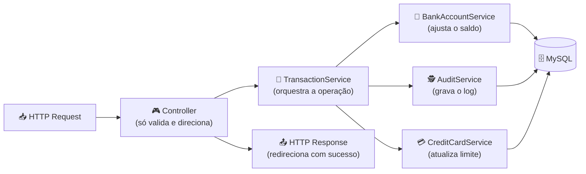
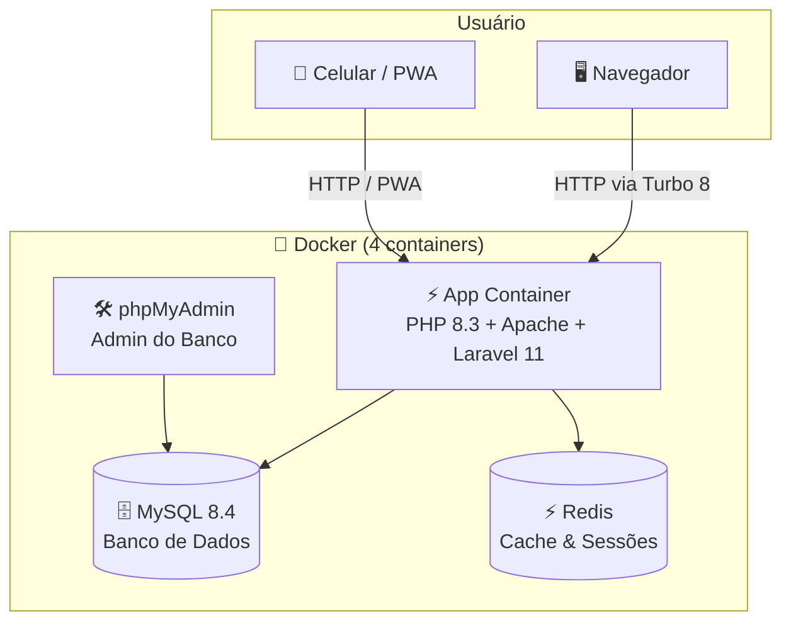
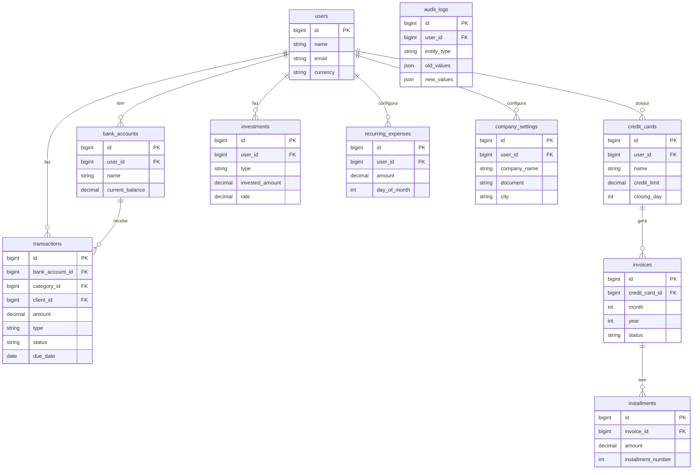

<div align="center">


# 🏛️ FinControl

**Sua vida financeira, finalmente sob controle.**

*Do fluxo de caixa à projeção do futuro — tudo em um painel elegante.*

<br>

[](https://laravel.com)
[](https://php.net)
[](https://mysql.com)
[](https://redis.io)
[](https://hotwired.dev)
[](https://www.docker.com/)

<br>

[](https://github.com/felipeassump22/fincontrol/stargazers)
[](https://github.com/felipeassump22/fincontrol/network)
[](#)
[](LICENSE)

---

**[✨ O que é?](#-o-que-é-o-fincontrol) · [🚀 Como rodar](#-como-rodar-o-projeto-passo-a-passo) · [👥 Usuários](#-usuários-perfis-e-permissões) · [⚙️ Funcionalidades](#%EF%B8%8F-tudo-que-o-fincontrol-faz) · [🏗️ Arquitetura](#%EF%B8%8F-como-o-projeto-foi-construído) · [📱 Mobile](#-acessando-pelo-celular)**

</div>

---

## ✨ O que é o FinControl?

O **FinControl** surgiu de um problema real: ferramentas financeiras são ou **simples demais** (planilhas do Excel) ou **complexas demais** (ERPs corporativos caros e feios). A proposta aqui é o meio-termo perfeito.

É uma plataforma web completa que:

- 📊 **Consolida** todas as suas contas bancárias num único painel
- 🔮 **Projeta** seu fluxo de caixa para os próximos 12 meses usando médias históricas
- 💳 **Monitora** o limite de múltiplos cartões de crédito em tempo real
- ⚙️ **Automatiza** despesas recorrentes (aluguel, assinaturas, salários) sem você precisar fazer nada
- 📈 **Acompanha** o rendimento dos seus investimentos (CDB, Tesouro Direto)
- 📄 **Exporta** relatórios gerenciais profissionais em PDF com dados da sua empresa
- 🔄 **Estorna** lançamentos pagos com transação inversa rastreável
- ⚙️ **Configura** moeda, idioma, tema e dados da empresa numa central dedicada
- 🕵️ **Registra** um log completo de tudo que foi alterado no sistema


---

## 🚀 Como Rodar o Projeto (Passo a Passo)

Antes de qualquer coisa: **você não precisa instalar PHP, MySQL, Composer nem nada disso.** Toda a magia acontece dentro do **Docker** — uma ferramenta que cria "caixinhas" virtuais no seu computador onde cada servidor roda isolado. Legal, né?

### 🐳 Passo 0 — Instalar o Docker Desktop

Se você ainda não tem o Docker instalado, esse é o único pré-requisito:

1. Acesse 👉 **[https://www.docker.com/products/docker-desktop/](https://www.docker.com/products/docker-desktop/)**
2. Baixe a versão para o seu sistema operacional (Windows, Mac ou Linux)
3. Instale como qualquer outro programa
4. Abra o **Docker Desktop** e espere o ícone da baleia 🐳 aparecer na barra de tarefas/menu bar
5. Quando o Docker mostrar **"Engine running"**, está pronto!

> [!IMPORTANT]
> O Docker Desktop precisa estar **aberto e rodando** para que os próximos passos funcionem. Antes de continuar, confira se o ícone da baleia 🐳 está ativo na sua barra de tarefas.

---

### 📂 Passo 1 — Baixar o Projeto

Abra o terminal do seu sistema operacional:
- **Windows:** Pressione `Windows + R`, digite `cmd` e aperte Enter
- **Mac:** Pressione `Cmd + Espaço`, digite `Terminal` e aperte Enter
- **Linux:** Use o atalho `Ctrl + Alt + T`

Agora cole os comandos abaixo e aperte Enter:

```bash
# Baixa o código do projeto para a sua máquina
git clone https://github.com/felipeassump22/fincontrol.git

# Entra na pasta do projeto
cd fincontrol
```

> [!TIP]
> **Não tem o Git instalado?** Sem problema! Na página do GitHub, clique no botão verde **"Code"** e depois em **"Download ZIP"**. Descompacte o arquivo e abra o terminal dentro dessa pasta.

---

### ⚡ Passo 2 — Subir os Servidores

Ainda no terminal, dentro da pasta do projeto, rode:

```bash
docker compose up -d --build
```

Esse único comando vai:
- 📦 Baixar as imagens do PHP 8.3, MySQL 8.4, Redis e phpMyAdmin
- 🔧 Instalar todas as dependências do PHP (via Composer) automaticamente
- 🚀 Iniciar 4 servidores em segundo plano (App, Banco, Cache, Admin)

> [!WARNING]
> **A primeira execução pode demorar entre 3 e 10 minutos**, pois o Docker precisa baixar as imagens oficiais dos servidores da internet (~500MB). Nas próximas vezes que você rodar, será instantâneo porque as imagens ficam salvas no seu computador. ☕ Vai lá pegar um café!

Quando terminar, você vai ver algo parecido com isso no terminal:
```
✔ Container fincontrol-db      Started
✔ Container fincontrol-redis   Started  
✔ Container fincontrol-app     Started
✔ Container fincontrol-admin   Started
```

---

### 🗄️ Passo 3 — Criar e Popular o Banco de Dados

Agora precisamos criar as tabelas no banco e colocar alguns dados de exemplo pra você testar. Rode:

```bash
docker compose exec app php artisan migrate:fresh --seed
```

Esse comando cria **15 tabelas** e insere automaticamente:
- 👤 4 usuários de teste (admin, financeiro e visualizadores)
- 🏦 Contas bancárias com saldos de demonstração
- 💳 Cartões de crédito com faturas e parcelas
- 📊 Histórico de transações em maio/2025 e no mês atual
- 💰 Investimentos e despesas recorrentes

---

### 🎉 Passo 4 — Acesse e Explore!

| O que acessar | Endereço | Login |
|:---|:---|:---|
| 🏛️ **FinControl App** | [http://localhost:8000](http://localhost:8000) | `joao@empresa.com.br` / `admin123` |
| 🛠️ **Gerenciador do Banco** | [http://localhost:8080](http://localhost:8080) | Usuário: `root` — Senha: `rootpass123` |

> [!TIP]
> **4 usuários disponíveis para teste após o seed:**
> | 👤 Usuário | 📧 E-mail | 🔑 Senha | 🎭 Perfil | ✅ Status |
> |:---|:---|:---|:---|:---:|
> | João Admin | `joao@empresa.com.br` | `admin123` | Administrador | Ativo |
> | Ana Financeiro | `financeiro@empresa.com.br` | `financeiro123` | Financeiro | Ativo |
> | Maria Viewer | `maria@empresa.com.br` | `viewer123` | Visualizador | Ativo |
> | Carlos Silva | `carlos@empresa.com.br` | `viewer123` | Visualizador | **Inativo** 🔒 |

---

### 🛑 Como Parar os Servidores

Quando terminar de usar, basta rodar:

```bash
docker compose down
```

Isso desliga todos os 4 servidores. Seus dados ficam salvos no banco. Da próxima vez que quiser usar, rode apenas:

```bash
docker compose up -d
```
*(Sem o `--build`, pois já foi construído antes — inicia em segundos!)*

---

## 👥 Usuários, Perfis e Permissões

O sistema possui um controle de acesso por **papéis (Roles)**, onde cada usuário tem um perfil que define o que ele pode ou não fazer.

### 🎭 Perfis Disponíveis

| Perfil | Descrição |
|:---|:---|
| 👑 **Administrador** | Acesso total. Pode criar, editar (inclusive pagos/conciliados), excluir e estornar lançamentos. |
| 💼 **Financeiro** | Pode registrar e gerenciar lançamentos, mas **só edita pendentes**. Não altera pagos nem conciliados. |
| 👁️ **Visualizador** | Pode visualizar dados, relatórios e projeções, mas **não pode criar, editar nem excluir** lançamentos. |

---

### 🔐 Mapa de Permissões por Ação

| Ação | 👑 Administrador | 💼 Financeiro | 👁️ Visualizador |
|:---|:---:|:---:|:---:|
| Visualizar lançamentos | ✅ | ✅ | ✅ |
| Visualizar relatórios e projeções | ✅ | ✅ | ✅ |
| Criar novo lançamento | ✅ | ✅ | ❌ |
| Editar lançamento pendente | ✅ | ✅ | ❌ |
| Editar lançamento **pago/conciliado** | ✅ | ❌ | ❌ |
| Excluir lançamento | ✅ | ❌ | ❌ |
| Marcar como pago / conciliar / cancelar | ✅ | ✅ | ❌ |
| Estornar lançamento pago | ✅ | ✅ | ❌ |
| Gerenciar contas bancárias | ✅ | ✅ | ❌ |
| Desativar/reativar contas | ✅ | ✅ | ❌ |
| Gerenciar cartões de crédito | ✅ | ✅ | ❌ |
| Cadastrar categorias e clientes | ✅ | ✅ | ❌ |
| Configurar dados da empresa (PDF) | ✅ | ✅ | ❌ |
| Alterar moeda pessoal | ✅ | ✅ | ✅ |
| Exportar PDF | ✅ | ✅ | ✅ |
| Fechar relatório mensal | ✅ | ❌ | ❌ |
| Ver auditoria do sistema | ✅ | ❌ | ❌ |

> [!CAUTION]
> **Regra de proteção de lançamentos:** o perfil **Financeiro** não consegue editar lançamentos **pagos ou conciliados** — a trava está no `TransactionPolicy` e no `TransactionService`, não apenas na interface. O **Administrador** pode editar qualquer status (exceto cancelados). Mesmo que alguém tente via Postman, o Financeiro recebe `403 Forbidden`.

---

### 👤 Usuários de Demonstração (Gerados pelo Seed)

| # | 👤 Nome | 📧 E-mail | 🔑 Senha | 🎭 Perfil | Status |
|:---:|:---|:---|:---|:---|:---:|
| 1 | João Admin | `joao@empresa.com.br` | `admin123` | 👑 Administrador | 🟢 Ativo |
| 2 | Ana Financeiro | `financeiro@empresa.com.br` | `financeiro123` | 💼 Financeiro | 🟢 Ativo |
| 3 | Maria Viewer | `maria@empresa.com.br` | `viewer123` | 👁️ Visualizador | 🟢 Ativo |
| 4 | Carlos Silva | `carlos@empresa.com.br` | `viewer123` | 👁️ Visualizador | 🔴 Inativo |

> [!NOTE]
> O usuário **Carlos Silva** está marcado como `is_active = false` no banco. Isso significa que ele existe mas **não consegue fazer login** — serve para demonstrar a desativação de usuários sem precisar excluí-los do sistema.
>
> **Dados compartilhados:** Financeiro e Visualizador visualizam os **mesmos lançamentos, contas e relatórios** do Administrador da empresa. Cada perfil mantém apenas preferências pessoais (moeda e tema) separadas.

---

## ⚙️ Tudo que o FinControl Faz

<details>
<summary><b>🔐 Autenticação e Segurança</b> — clique para expandir</summary>
<br>

| Funcionalidade | Como foi feito |
|:---|:---|
| Login por e-mail e senha | Senhas protegidas com `Bcrypt` — o mesmo padrão do GitHub e do Nubank |
| Bloqueio de inativos | Usuários com `is_active = false` não conseguem autenticar |
| Proteção de rotas | Middleware `auth` e `role:Administrador` conforme o módulo |
| Controle por perfil | Policies em transações, contas, clientes, cartões e relatórios |
| Proteção CSRF | Tokens anti-falsificação em todos os formulários (padrão Laravel) |

</details>

<details>
<summary><b>💰 Contas Bancárias e Lançamentos</b> — clique para expandir</summary>
<br>

| Funcionalidade | Como foi feito |
|:---|:---|
| Múltiplas contas bancárias | Cada conta tem saldo individual, agência, número, Pix e documento |
| Desativar conta (sem excluir) | `BankAccountService::deactivate()` preserva lançamentos; contas inativas somem dos selects |
| Lançamentos (receitas/despesas) | CRUD com categoria, cliente, competência, método de pagamento e anexo de NF |
| Status completos | `PENDING`, `PAID`, `CANCELED`, `RECONCILED` — com fluxos de pagar, conciliar e cancelar |
| Filtros rápidos | Hoje, esta semana, este mês e mês anterior via `resolvePeriodFilters()` |
| Estorno de lançamento | `TransactionService::reverse()` cria transação inversa vinculada por `reversal_of_id` |
| Categorias BOTH | Categorias que servem para receita e despesa, com flag `requires_client` |
| Alerta de saldo negativo | A interface destaca contas ativas com saldo abaixo de R$ 0,00 |
| Anexo de comprovantes | Upload de NFs e comprovantes por lançamento, com download avulso |
| Atualização atômica de saldo | O `BankAccountService` usa operações atômicas (`increment/decrement`) para evitar erros em múltiplos acessos simultâneos |

</details>

<details>
<summary><b>💳 Cartões de Crédito e Faturas</b> — clique para expandir</summary>
<br>

| Funcionalidade | Como foi feito |
|:---|:---|
| Múltiplos cartões | Cada cartão tem seu limite, data de fechamento e fatura mensal independente |
| Parcelamento inteligente | O `InstallmentService` divide o valor em parcelas e usa um algoritmo de absorção de centavos para garantir que a soma seja sempre exata (sem R$ 0,01 de diferença por arredondamento) |
| Limite disponível em tempo real | Calcula o uso atual somando todas as faturas abertas e parcelas pendentes |
| Status de fatura | `ABERTA`, `FECHADA` e `PAGA` para controle do ciclo de fechamento |

</details>

<details>
<summary><b>👥 Clientes</b> — clique para expandir</summary>
<br>

| Funcionalidade | Como foi feito |
|:---|:---|
| Cadastro completo | CPF/CNPJ com validação de dígitos verificadores no `ClientController` |
| Endereço com ViaCEP | Busca automática de logradouro, bairro, cidade e UF pelo CEP |
| Vínculo com receitas | Cliente obrigatório em categorias marcadas com `requires_client` |

</details>

<details>
<summary><b>📈 Dashboard Inteligente</b> — clique para expandir</summary>
<br>

| Funcionalidade | Como foi feito |
|:---|:---|
| Seletor de período | Filtro por mês/ano no topo do painel |
| Métricas com comparativo | Receitas, despesas e saldo líquido com variação % vs mês anterior |
| Gráfico Receitas vs Despesas | Dados reais do período agrupados por dia (`ReportService::getIncomeExpenseByDay`) |
| Projeção embutida | Gráfico de fluxo de caixa para os próximos 6 meses no próprio dashboard |
| Receitas por categoria/cliente | Barras de progresso e tabela com participação percentual |
| Exportar PDF rápido | Atalho direto do dashboard para o relatório mensal |

</details>

<details>
<summary><b>🔮 Projeção de Fluxo de Caixa</b> — clique para expandir</summary>
<br>

| Funcionalidade | Como foi feito |
|:---|:---|
| Projeção algorítmica | O `CashFlowProjectionService` calcula a **média histórica** dos últimos 3 meses e projeta o saldo estimado para 1, 3, 6 ou 12 meses à frente |
| Filtro por conta e período | Permite analisar a projeção de uma conta específica num intervalo personalizado (`/reports/cash-flow`) |
| Rentabilidade de investimentos | Calcula o rendimento de CDBs e Tesouro Direto com base na taxa e data de início |

</details>

<details>
<summary><b>⚙️ Automação de Despesas Recorrentes</b> — clique para expandir</summary>
<br>

Você configura uma vez: "todo dia 1° debitar R$ 2.500,00 de aluguel da conta Bradesco". O sistema faz o resto sozinho, todo mês, sem você precisar fazer nada.

Tecnicamente, o `RecurringExpenseService` é chamado por um **CRON Job** agendado pelo Laravel Scheduler todo primeiro dia do mês.

</details>

<details>
<summary><b>📊 Relatórios e Analytics</b> — clique para expandir</summary>
<br>

| Funcionalidade | Como foi feito |
|:---|:---|
| Receitas por categoria | Mostra percentualmente de qual categoria vem o maior faturamento |
| Receitas por cliente | Identifica seus clientes mais rentáveis com participação % |
| Pagamentos por cliente | Relatório segmentado por status: pago, pendente e cancelado (`/reports/client-payments`) |
| Relatório contábil | Filtro por ENTRADA, SAÍDA ou AMBOS com totais e listagem (`/reports/accounting`) |
| Fechamento mensal | `POST /reports/close` torna o relatório imutável após o fechamento |
| Relatório mensal em PDF | Exporta relatório gerencial com cabeçalho da empresa (`company_settings`) |
| Projeção de caixa | Página dedicada com horizonte de 1, 3, 6 ou 12 meses |

</details>

<details>
<summary><b>🎛️ Central de Configurações</b> — clique para expandir</summary>
<br>

| Funcionalidade | Como foi feito |
|:---|:---|
| Tema visual | Claro, Escuro, AMOLED ou Sistema — persistido em `localStorage` |
| Moeda padrão | BRL, USD, EUR ou GBP por usuário — afeta helper `money()` em toda a interface |
| Idioma | Português (BR) e English (US) via `LanguageController` |
| Dados da empresa | Razão social, CNPJ, endereço e contatos salvos em `company_settings` para o PDF |
| ViaCEP | Preenchimento automático de endereço no formulário da empresa |

</details>

<details>
<summary><b>🕵️ Auditoria Total do Sistema</b> — clique para expandir</summary>
<br>

Cada mutação de dados no sistema gera automaticamente um registro em `audit_logs` com:
- 👤 **Quem** fez a alteração
- 📋 **O que** foi alterado (qual campo)
- 🕐 **Quando** (timestamp preciso)
- 🔴 **Valor anterior** (em JSON)
- 🟢 **Novo valor** (em JSON)

</details>

---

## 🏗️ Como o Projeto Foi Construído

### O Problema que o Service Pattern resolve

Imagine que você faz um lançamento de R$ 500,00. O que acontece nos bastidores?

1. Valida se os dados estão corretos
2. Cria o registro do lançamento no banco
3. Debita R$ 500,00 da conta bancária
4. Registra no log de auditoria
5. Se for de cartão, atualiza o limite disponível

Colocar tudo isso dentro de um `Controller` seria uma bagunça impossível de testar e manter. O **Service Pattern** isola cada responsabilidade:



### Visão Completa da Infraestrutura



### Os 9 Services da Aplicação

| Service | O que ele faz |
|:---|:---|
| `TransactionService` | O coração do sistema — gerencia todo o ciclo de vida de um lançamento |
| `BankAccountService` | Ajusta saldos com operações atômicas para evitar inconsistências |
| `InstallmentService` | Cria parcelas com algoritmo que garante soma matematicamente exata |
| `CreditCardService` | Calcula em tempo real quanto limite foi usado em cada cartão |
| `CashFlowProjectionService` | Lê o histórico e projeta o futuro financeiro do usuário |
| `RecurringExpenseService` | Injeta despesas recorrentes mensalmente de forma automática |
| `MonthlyReportService` | Gera o PDF do relatório gerencial com DOMPdf |
| `ReportService` | Agrega dados por categoria e cliente para os gráficos |
| `AuditService` | Registra silenciosamente cada alteração feita no sistema |

---

## 🗄️ Banco de Dados

O sistema possui **15 tabelas** organizadas em módulos lógicos:



---

## 💻 Stack Completo

| O quê | Tecnologia | Por que essa escolha |
|:---|:---:|:---|
| Linguagem backend | **PHP 8.3** | JIT Compiler, tipos fortes e enorme ecossistema financeiro |
| Framework | **Laravel 11** | Roteamento, ORM, Agendamento e Segurança já incluídos |
| Banco de dados | **MySQL 8.4** | Conformidade ACID — fundamental para operações financeiras |
| Cache | **Redis** | Sessões e preferências de tema com latência de milissegundos |
| Frontend | **Hotwire Turbo 8** | Navegação instantânea tipo SPA sem precisar de React ou Vue |
| Estilização | **CSS3 puro** | Sistema de variáveis CSS para 3 temas (Light, Dark, AMOLED) |
| PDF | **DOMPdf** | Geração de relatórios HTML → PDF no servidor |
| Infra | **Docker Compose** | 4 containers orquestrados num só comando |

---

## 📱 Acessando pelo Celular

O FinControl é um **Web App Responsivo** — funciona no celular sem instalar nada.

**Como acessar:**

1. ✅ Docker rodando no seu computador
2. 📶 Celular e computador na **mesma rede Wi-Fi**
3. 🔍 Descubra o IP do seu computador:
   - **Windows:** `ipconfig` no CMD → procure "Endereço IPv4"
   - **Mac:** Preferências de Sistema → Rede
   - **Linux:** `hostname -I` no terminal
4. 📱 No navegador do celular, acesse: `http://SEU_IP:8000`

> [!TIP]
> **Transforme em app nativo!**
> - **iPhone (Safari):** Botão de compartilhar → "Adicionar à Tela de Início" 📲
> - **Android (Chrome):** Menu (⋮) → "Adicionar à tela inicial" 📲
>
> O FinControl vai abrir sem barra de endereço, igualzinho a um aplicativo instalado da loja!

---

## 📁 Estrutura de Arquivos

```
fincontrol/
│
├── 📂 app/
│   ├── 📂 Console/Commands/       # Comando para gerar recorrências mensais
│   ├── 📂 Enums/                  # Status, tipos e métodos de pagamento tipados
│   ├── 📂 Http/Controllers/       # 15+ Controllers (um por módulo do sistema)
│   ├── 📂 Models/                 # 14 Models Eloquent (tabelas do banco)
│   ├── 📂 Policies/               # Controle de acesso por perfil (Admin/Financeiro/Viewer)
│   └── 📂 Services/               # 9 Services com toda a lógica de negócio
│
├── 📂 database/
│   ├── 📂 migrations/             # 20 Migrations (estrutura evolutiva do banco)
│   └── 📂 seeders/                # Dados de demonstração gerados automaticamente
│
├── 📂 resources/
│   ├── 📂 lang/                   # Traduções PT-BR e EN
│   └── 📂 views/                  # Templates Blade (HTML da aplicação)
│       ├── layouts/               # Sidebar, Topbar e sistema de temas
│       ├── dashboard/             # Painel principal com gráficos
│       ├── transactions/          # Tela de lançamentos
│       ├── bank-accounts/         # Contas bancárias
│       ├── credit-cards/          # Cartões de crédito
│       ├── clients/               # Cadastro de clientes
│       ├── settings/              # Central de configurações
│       ├── reports/               # Relatórios e projeções
│       └── reports/pdf/           # Template do PDF exportável
│
├── 📂 public/
│   ├── 📂 css/                    # Design System (3 temas: Light, Dark, AMOLED)
│   └── 📂 storage/                # Notas fiscais e comprovantes enviados
│
├── 📂 routes/
│   └── web.php                    # Todas as rotas da aplicação
│
└── 🐳 docker-compose.yml          # Configuração dos 4 containers Docker
```

---

<div align="center">

### Feito com 💙 e muito ☕

*Construído com obsessão por qualidade.*

[](https://github.com/felipeassump22/fincontrol/stargazers)
[](https://github.com/felipeassump22/fincontrol/network)

</div>
